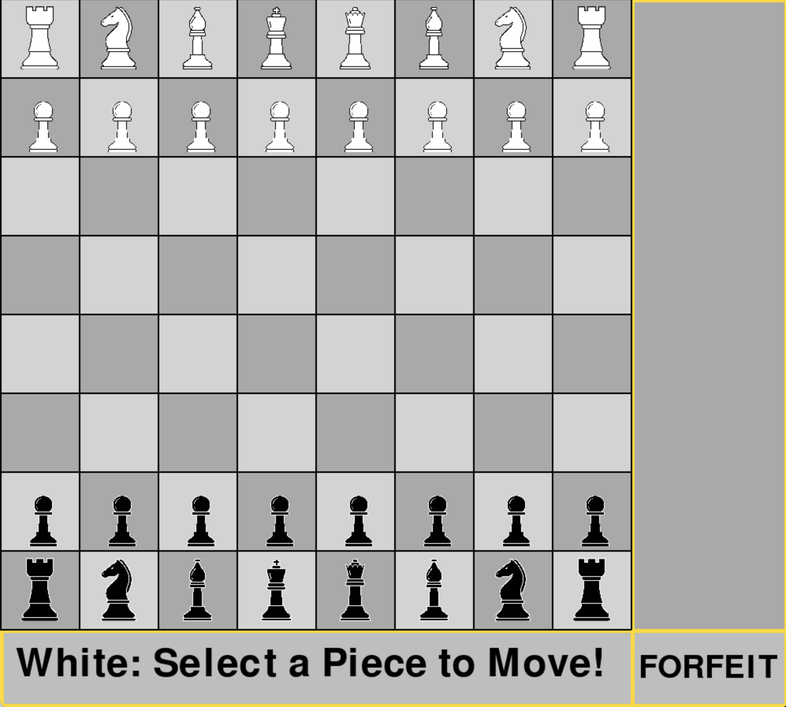
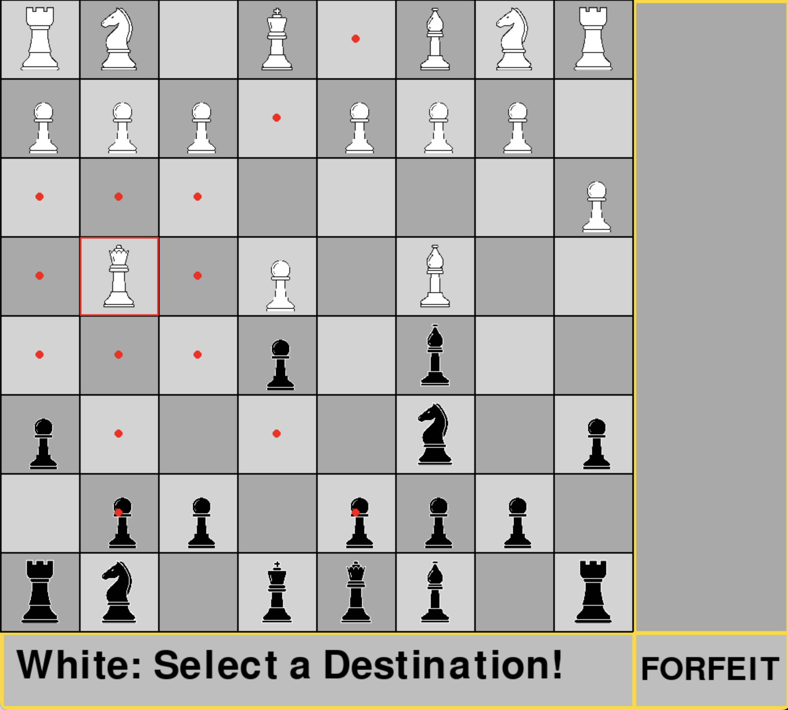

# Two-Player Chess in Python with Pygame

This project implements a two-player chess game using Python and the Pygame library. The game features an interactive GUI where players can select and move pieces according to standard chess rules. The board is drawn dynamically, and the positions of the pieces are updated in real-time based on player inputs. The game checks for valid moves for each piece, including special moves like castling and pawn promotion, and highlights possible moves and captures. Additionally, the game keeps track of captured pieces and displays them on the side of the board. When a king is in check, the square flashes to alert the players. The game concludes when one player checkmates the other or a player forfeits.

